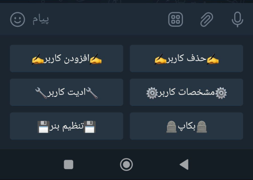

# Telegram :
https://t.me/xpanel_telegrambot

# نصب 
دستورات زیر را برای نصب در سرور خود وارد کنید :
```
pip install requests

pip install telebot

sudo apt-get install screen

git clone https://github.com/mrkiller90/killer-bot

cd killer-bot 

```
سپس با نانو فایل ربات را ادیت کنید :
```
nano bott.py
```
و بعد ربات را اجرا کنید : 
```
cp bott.py /root

screen python3 bott.py
```
# آپدیت و نصب مجدد 
دستورات زیر را برای آپدیت و نصب مجدد وارد بکنید :

```
screen -r 
``` 
سپس کلید CTRL + C را وارد و دستورات بعد را اجرا کنید :

```
rm -rf killer-bot

rm -rf bott.py

git clone https://github.com/mrkiller90/killer-bot

cd killer-bot

cp bott.py /root

screen python3 bott.py
```
# حذف 
برای حذف کافی است دستورات زیر را وارد کنید :
```
rm -rf killer-bot 
rm -rf bott.py
```
# قابلیت ها :

